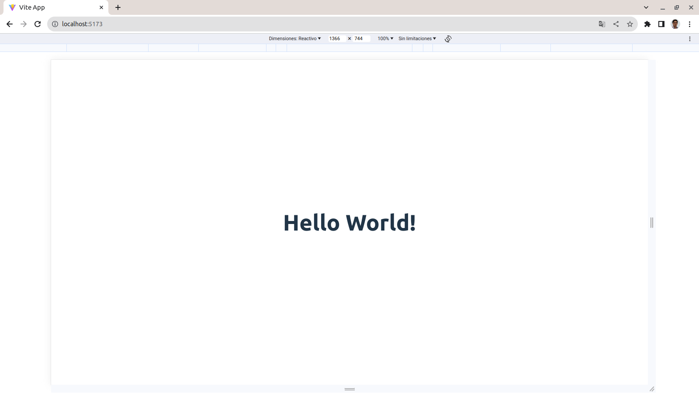

# Configuracion Inicial para una app en React de 0 con Vite

Basado en la primer parte de este [challenge de Midu](https://www.youtube.com/watch?v=XYpadB4VadY) me pareció interesante tener una guía paso a paso de como configurar una app de react desde 0, sin utilizar un scaffolding de un CLI como `create-react-app` o el propio `vite`, Así que a por ello.

## 1. Inicializamos el proyecto

- Creamos el proyecto con vite

```bash
npm create vite@latest
```

- Elegimos Vainilla asi podemos realizar toda la configuración de React manualmente desde 0.

```bash
Select a framework: › - Use arrow-keys. Return to submit.
❯   Vanilla
    Vue
    React
    Preact
    Lit
    Svelte
    Solid
    Qwik
    Others
```

## 2. Instalando react

- instalar react implica instalar los paquetes `react` y `react-dom`

```bash
npm i react react-dom -E #-E para la version exacta
```

- instalamos el plugin de `react` para `vite`

```bash
npm i --save-dev @vitejs/plugin-react -E
```

- creamos el archivo `vite.config.js` y definimos la configuracion

```js
import { defineConfig } from 'vite'
import react from '@vitejs/plugin-react'

export default defineConfig({
  plugins: [react()]
})
```

## 3. Configurando el entrypoint del proyecto

Es tiempo de definir el punto de entrada de nuestra aplicacion, para eso vamos a:

- renombrar nuestro archivo `main.js` por `main.jsx`
- en este archivo vamos a definir como montar en el nodo `app` del dom, el componente principal de nuestra aplicación `App.jsx`.

```js
import './style.css'
import { createRoot } from 'react-dom/client'
import App from './src/App.jsx'

const root = createRoot(document.getElementById('app'))

root.render(<App />)
```

- a continuación en el archivo `index.html`, tenemos que renombrar el script `main.js` por `main.jsx`.

```html
<!DOCTYPE html>
<html lang="en">
  <head>
    <meta charset="UTF-8" />
    <link rel="icon" type="image/svg+xml" href="/vite.svg" />
    <meta name="viewport" content="width=device-width, initial-scale=1.0" />
    <title>Vite App</title>
  </head>
  <body>
    <!-- Este en el nodo en donde se montara al aplicacion de React -->
    <div id="app"></div>
    <!-- este es el script que es el punto de entrada de nuestro aplicativo -->
    <!-- <script type="module" src="/main.js"></script> -->
    <script type="module" src="/main.jsx"></script>
  </body>
</html>
```

- lo último que nos queada por definir, para tener el nuestra app inicial andando, es nuestro componente principal de react, el archivo lo vamos a definir en `src/App.jsx` el cual inicialmente podemos dejarlo de esta manera:

```jsx
export default function () {
  return <h1>Hello World!</h1>
}
```

ya con esto, podemos ejecutar `npm run dev` y si todo salió como lo esperabamos la consola te va a mostrar un mensaje como el siguiente:

```bash
  VITE v4.5.0  ready in 970 ms

  ➜  Local:   http://localhost:5173/
  ➜  Network: use --host to expose
  ➜  press h to show help
```

lo cual significa que vite esta corriendo el dev server.



## 4. Linter y prettier

Una vez que tenemos nuestro `Hello World!` funcionando, hay que instalar el LINTER. Esto es "Mucho muy importante"

```bash
npm i standard -D
```

y agregamos al `package.json` lo siguente:

```json
"eslintConfig": {
    "extends": [
      "./node_modules/standard/eslintrc.json"
    ]
  }
```

_extra:_ tambien podemos definir un `.prettierrc` para definir unas reglas que se corrigan de manera automatica al guardar los archivos.

```js
{
  "singleQuote": true,
  "trailingComma": "none",
  "semi": false
}
```

---

Listo, ahora si ya tenemos todo configurado como para continuar con cualquier proyecto con un scaffolding inicial hecho por nosotros mismos.
